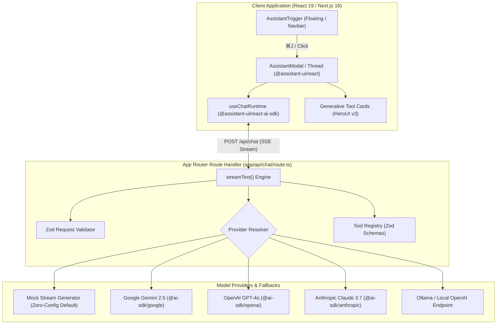
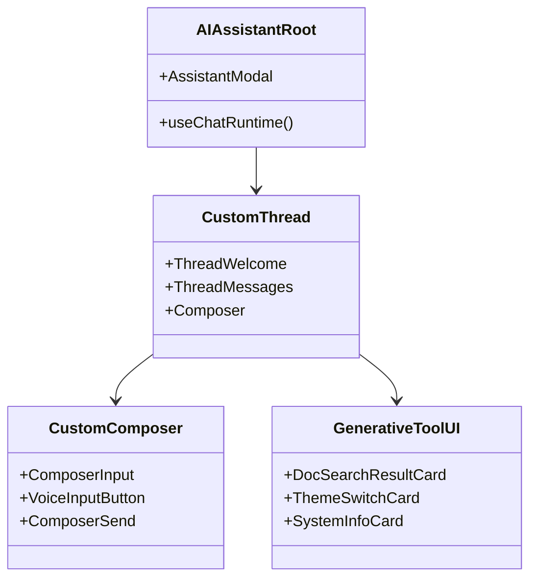
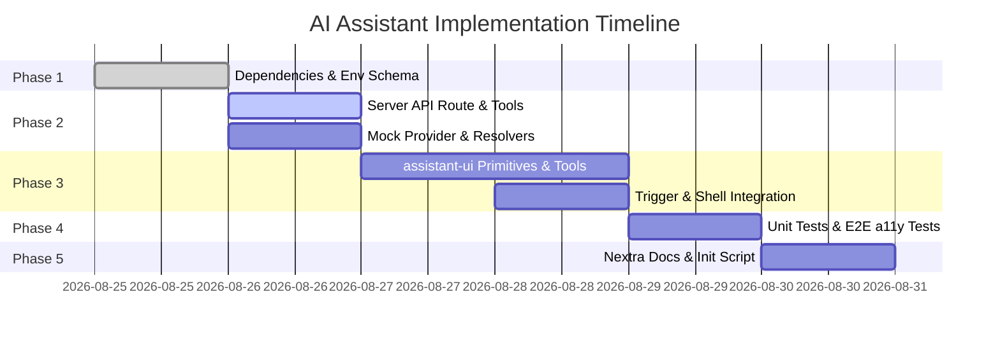

# Implementation Plan - AI Assistant Support (add-ai-assistant)

This plan details the technical architecture and implementation roadmap for adding state-of-the-art AI Assistant support to `cur8d.tsx` using **`assistant-ui` (`@assistant-ui/react`)** and **Vercel AI SDK (`ai`)**.

---

## 1. System Architecture



---

## 2. Component Hierarchy & File Structure



### Proposed Directory Layout
```
app/
├── api/
│   └── chat/
│       └── route.ts                 # Next.js App Router POST handler using streamText
├── components/
│   └── AIAssistant/
│       ├── index.tsx                # assistant-ui AssistantModal container & provider
│       ├── AssistantTrigger.tsx     # Floating button with shortcut badge & tooltip
│       ├── Thread.tsx               # assistant-ui Thread configuration & styling
│       ├── Composer.tsx             # assistant-ui Composer with Web Speech API voice button
│       ├── SuggestedPrompts.tsx     # Starter prompt pill chips
│       └── tools/
│           ├── DocSearchTool.tsx    # Generative UI card for doc search results
│           ├── ThemeTool.tsx        # Generative UI badge for theme changes
│           └── SystemInfoTool.tsx   # Generative UI card for stack metrics
├── hooks/
│   └── use-speech-to-text.ts        # Web Speech API speech-to-text hook
└── lib/
    └── ai/
        ├── config.ts                # Model & provider resolver
        ├── env.ts                   # Zod schema for AI environment variables
        ├── system-prompt.ts         # Grounded system instructions & context
        ├── tools.ts                 # Server tool definitions with Zod schemas
        └── mock-provider.ts         # Zero-config realistic mock streamer for dev/CI

docs/content/features/
└── ai-assistant.mdx                 # Nextra feature guide

tests/
├── unit/
│   ├── api/
│   │   └── chat.route.test.ts       # Vitest tests for POST /api/chat
│   ├── components/
│   │   └── AIAssistant/
│   │       └── index.test.tsx       # assistant-ui integration tests
│   └── lib/
│       └── ai/
│           ├── config.test.ts       # Provider resolver tests
│           └── tools.test.ts        # Tool definitions tests
└── e2e/
    └── ai-assistant.spec.ts         # Playwright E2E & axe-core a11y tests
```

---

## 3. Implementation Phases



### Phase 1: Toolchain, Dependencies & Environment
- Add packages:
  - `@assistant-ui/react`, `@assistant-ui/react-ai-sdk`, `@assistant-ui/react-markdown`, `@assistant-ui/react-syntax-highlighter`
  - `ai`, `@ai-sdk/google`, `@ai-sdk/openai`, `@ai-sdk/anthropic`
- Configure environment variables in `.env.example` and Zod validation in `app/lib/ai/env.ts`.

### Phase 2: AI Core Logic & Server API Route
- Implement provider resolver `app/lib/ai/config.ts` and `mock-provider.ts`.
- Implement tool definitions with Zod schemas in `app/lib/ai/tools.ts`.
- Implement App Router route handler `app/api/chat/route.ts` using `streamText()` and centralized error reporting.

### Phase 3: Client Components (`@assistant-ui/react`) & Generative UI
- Configure `useChatRuntime` from `@assistant-ui/react-ai-sdk`.
- Implement customized `Thread`, `Composer` (with voice input), and `AssistantModal`.
- Implement generative tool renderers (`DocSearchTool`, `ThemeTool`, `SystemInfoTool`).
- Mount `<AIAssistant />` in `app/layout.tsx` and Navbar trigger.

### Phase 4: Testing & Accessibility
- Unit tests (`tests/unit/api/chat.route.test.ts`, `tests/unit/components/AIAssistant/index.test.tsx`, `tests/unit/lib/ai/`).
- Playwright E2E tests (`tests/e2e/ai-assistant.spec.ts`) with `@axe-core/playwright` accessibility audits.
- Validate $\ge 80\%$ test coverage with `mise run test:coverage`.

### Phase 5: Documentation & Scaffolding
- Add documentation page `docs/content/features/ai-assistant.mdx`.
- Update `scripts/init.ts` and `AGENTS.md`.

---

## 4. Verification Plan

### Automated Verification
```bash
# Typecheck
pnpm typecheck

# Linting
pnpm lint

# Unit Tests (>= 80% coverage)
pnpm test:coverage

# E2E & Accessibility Tests
pnpm test:e2e

# Production Build
pnpm build
```

### Manual Verification
- Verify modal opening via floating trigger and `⌘J` / `Ctrl+J`.
- Verify real-time token streaming and code copy buttons.
- Verify tool execution cards in chat thread.
- Verify theme changes and responsive mobile layout.
