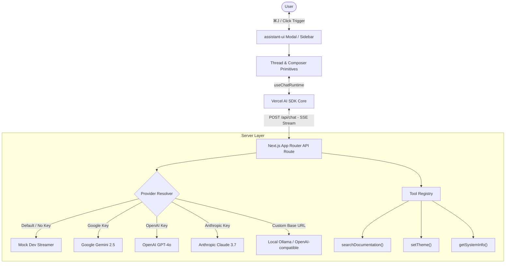
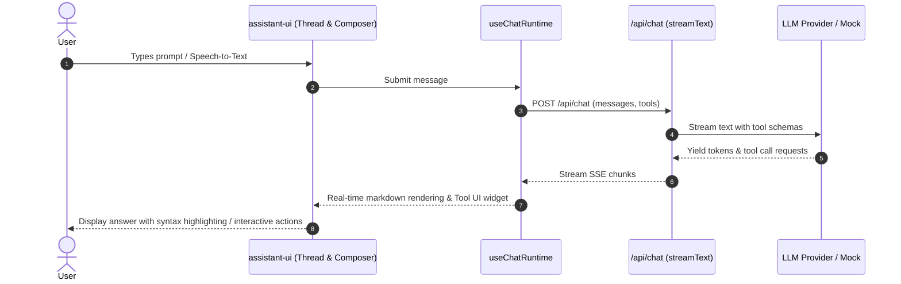

# Requirements: AI Assistant Support (add-ai-assistant)

## 1. Executive Summary & Vision

The goal of this feature is to introduce a **state-of-the-art, production-ready AI Assistant** into the `cur8d.tsx` starter template using industry-standard, established libraries rather than reinventing the wheel.

The AI Assistant integration combines:
1. **`assistant-ui` (`@assistant-ui/react`)**: The premier open-source React UI library built specifically for AI chat interfaces, providing composable primitives for threads, composers, streaming markdown, syntax highlighting, generative UI tools, auto-scrolling, branch navigation, and modal/sidebar shells.
2. **Vercel AI SDK (`ai`, `@assistant-ui/react-ai-sdk`)**: Unified LLM abstraction and streaming runtime supporting tool calling, multi-step agents, and runtime provider switching.
3. **Multi-Provider & Zero-Config Architecture**: Out-of-the-box support for Google Gemini, OpenAI, Anthropic Claude, and local LLMs (Ollama), with a **zero-config Mock Provider** so starter clones run immediately without requiring API keys.
4. **Strict Standards & Aesthetics**: Tailored to `cur8d`'s HeroUI v3 design system, Tailwind CSS v4 theming, strict TypeScript, WCAG AAA/AA accessibility, and $\ge 80\%$ test coverage.

---

## 2. Architecture & Interaction Flow

---

## 3. Tech Stack & Dependencies

Rather than building chat components, markdown streaming, code highlighting, and auto-scroll logic from scratch, the feature leverages the `assistant-ui` ecosystem:

| Package | Purpose | Category |
| :--- | :--- | :--- |
| `@assistant-ui/react` | Headless & styled AI chat primitives (`Thread`, `Composer`, `AssistantModal`, `MessagePrimitive`) | Existing UI Library |
| `@assistant-ui/react-ai-sdk` | Official runtime bridge connecting `assistant-ui` with Vercel AI SDK (`useChatRuntime`) | Integration |
| `@assistant-ui/react-markdown` | Streaming markdown parser with smooth rendering & code blocks | UI / Markdown |
| `@assistant-ui/react-syntax-highlighter` | Syntax-highlighted code blocks with line numbers and one-click copy buttons | Code Display |
| `ai` | Vercel AI SDK Core (`streamText`, tool calling, message schemas) | Backend Runtime |
| `@ai-sdk/google` | Google Gemini API provider | AI Provider |
| `@ai-sdk/openai` | OpenAI API provider | AI Provider |
| `@ai-sdk/anthropic` | Anthropic Claude provider | AI Provider |
| `@heroui/react` | HeroUI v3 design system tokens and compound components for custom tool cards | Design System |
| `lucide-react` | Icons (`Bot`, `Sparkles`, `Send`, `Mic`, `Copy`, `Check`, `RotateCcw`) | Icon Library |
| `zod` | Zod schema validation for tools and environment variables | Validation |

---

## 4. Detailed Functional Requirements

### 4.1. UI Shell & Launch Modes (`assistant-ui`)
- **Assistant Modal / Trigger**:
  - Floating Action Button trigger anchored at the bottom-right corner with subtle glow and shortcut badge (`⌘J` / `Ctrl+J`).
  - Slide-over drawer / modal shell powered by `@assistant-ui/react`'s `<AssistantModal>` or `<AssistantSidebar>` with customizable width and backdrop.
  - Navbar button in desktop header providing secondary access.
  - Full keyboard control (`⌘J` to toggle, `Escape` to dismiss, auto-focus input upon opening).

### 4.2. Thread, Streaming & Markdown Capabilities
- **Thread Experience**:
  - Virtualized auto-scrolling message list with smooth pin-to-bottom behavior.
  - Multi-turn conversation display with branch switching (edit previous user prompt & view alternative branches).
  - Suggested starter prompt pills on empty thread state.
- **Streaming Markdown & Code Blocks**:
  - Handled via `@assistant-ui/react-markdown` and `@assistant-ui/react-syntax-highlighter`.
  - Syntax highlighting for 50+ programming languages.
  - Copy code button with confirmation feedback.
- **Message Actions**:
  - Stop generation button (AbortController).
  - Reload / Regenerate button.
  - Copy message text / markdown.

### 4.3. Generative UI & Tool Calling
Integrate custom tool renderers inside `assistant-ui`'s `<ToolFallback>` / `makeAssistantToolUI`:
1. **`searchDocumentation`**:
   - Searches Nextra docs and sitemap.
   - Renders interactive HeroUI card with document title, excerpt snippet, and direct link navigation.
2. **`setTheme`**:
   - Switches active theme (`light`, `dark`, `system`) on the client and renders a theme switch status pill.
3. **`getSystemInfo`**:
   - Queries stack metadata (Next.js 16, React 19, HeroUI v3, Tailwind v4) and reports environment status.
4. **`navigatePage`**:
   - Renders confirmation card with a button to navigate to target route.

### 4.4. Input, Speech & Persistence
- **Composer**:
  - Auto-growing multiline textarea with `Enter` (send) and `Shift + Enter` (newline).
  - Integrated speech-to-text voice input button using Web Speech API with fallback.
- **Local Persistence**:
  - Chat history preserved across page reloads via `localStorage` integration.

### 4.5. Multi-Provider & Zero-Config Fallback
- **Environment Driven Provider**:
  - `AI_PROVIDER`: `"mock"` (default) | `"google"` | `"openai"` | `"anthropic"` | `"custom"`.
  - `AI_MODEL`: Specific model identifier (e.g. `gemini-2.5-flash`, `gpt-4o-mini`, `claude-3-7-sonnet`).
  - `GOOGLE_GENERATIVE_AI_API_KEY`, `OPENAI_API_KEY`, `ANTHROPIC_API_KEY`, `AI_BASE_URL`.
- **Zero-Config Mock Provider**:
  - When no API key is present or `AI_PROVIDER="mock"`, realistic streaming responses and mock tool calls are simulated.

---

## 5. Non-Functional & Architecture Requirements

### 5.1. TypeScript & Code Quality
- Strict TypeScript (`"strict": true`), zero `any` types.
- Explicit interfaces for all custom tool components and hook parameters.
- Co-located component structure under `app/components/AIAssistant/`.

### 5.2. Accessibility & Performance
- Full keyboard operability and focus management provided by `@assistant-ui/react` primitives.
- ARIA live region announcements for streaming message updates.
- Axe-core accessibility clean (zero WCAG violations).

### 5.3. Testing Strategy
- **Vitest Unit Tests ($\ge 80\%$ coverage)**:
  - `app/api/chat/route.test.ts` (API route streaming, error handling, mock fallback).
  - `app/components/AIAssistant/index.test.tsx` (Assistant trigger, modal state, tool card rendering).
  - `app/lib/ai/tools.test.ts` (Tool schemas & execution).
- **Playwright E2E Tests**:
  - End-to-end verification of opening modal, submitting prompt, streaming mock response, and running axe-core a11y audit.

---

## 6. Documentation & Template Scaffolding
- **Documentation**: Nextra documentation page at `docs/content/features/ai-assistant.mdx`.
- **Template Init**: Integration with `scripts/init.ts` to customize AI settings when scaffolding a new project.
- **Project Guides**: Updates to `AGENTS.md` and `README.md`.
